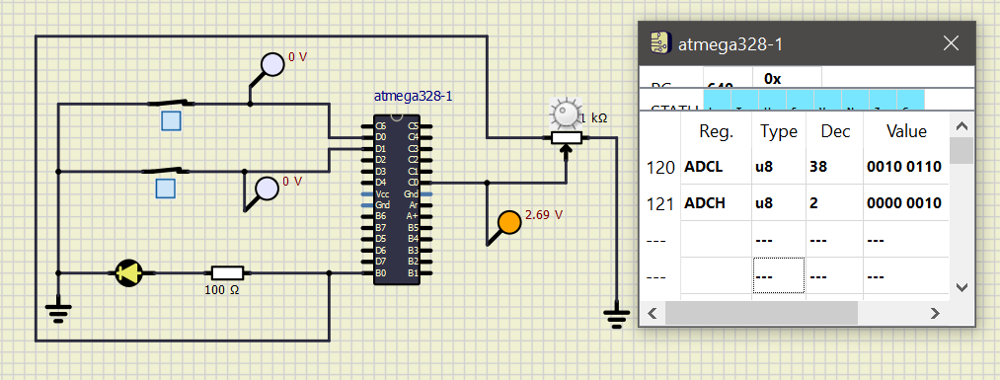

# MiniProject_EmbeddedC_260913
## Activity-1

|ON|OFF|
|--|--|
| | |

## Activity-2

## Activity-3

## Activity-4

# Heat Control Application
## Simulation Process

|Build|Cpp Check|Codacy|
|-----|---------|------|
|||